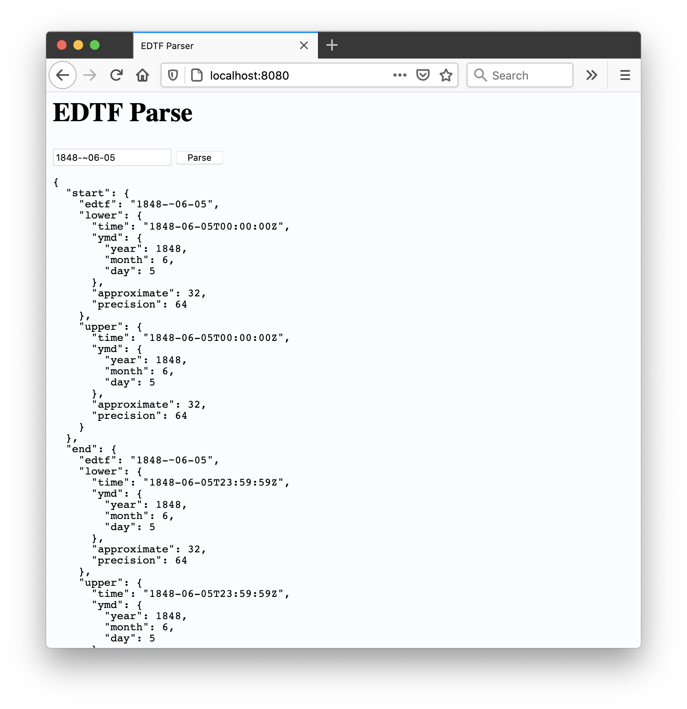

# go-edtf-wasm



## Important

This is work in progress and not ready for general use yet.

## Building go-edtf-wasm

The easiest thing is to run the `wasm` Makefile target, like this:

```
$> make wasm
GOOS=js GOARCH=wasm go build -mod vendor -o www/wasm/parse.wasm cmd/parse/main.go
```

This will place a copy of the `parse.wasm` binary in `www/wasm/parse.wasm`.

The binary exposes a single `parse_edtf` function that takes a single string as its input and returns a JSON-encoded [edtf.EDTFDate](https://github.com/sfomuseum/go-edtf#date-spans-or-edtfedtfdate), or nil, as its response. Obviously returning nil when there is a problem isn't great so the final return value remains to be determined.

## Serving go-edtf-wasm

The package comes with a handy `server` tool for serving the `parse.wasm` binary and a simple web page for parsing EDTF date strings.

```
$> make cli
go build -mod vendor -o bin/server cmd/server/main.go
```

The to run the server:

```
$> ./bin/server 
2021/01/07 17:56:48 Listening on http://localhost:8080
```

By default the `server` tool assumes it is running from the `go-edtf-wasm` folder and that it can find its `www` there. The `www` folder contains the `parse.wasm` binary and the web application that uses it.

If you need or want to specify an alternate root directory start the server tool with the `-root` flag pointing to the correct folder to use.

_Once Go 1.16 has been released and the `www` folder can be embedded directly in the `server` binary that will become the default behaviour._

## See also

* https://github.com/sfomuseum/go-edtf