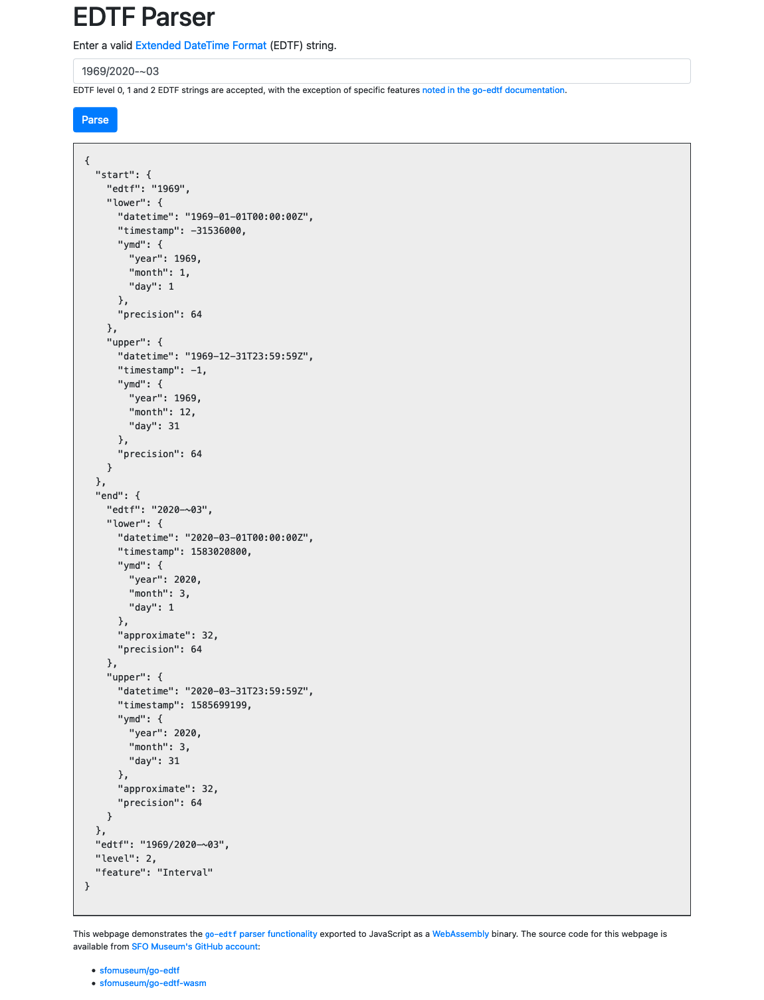

# go-edtf-wasm



Go package for exposing sfomuseum/go-edtf functionality as WebAssembly binaries.

## WASM

### Building

The easiest thing is to run the `wasm` Makefile target, like this:

```
$> make wasm
GOOS=js GOARCH=wasm go build -mod vendor -o www/wasm/parse.wasm cmd/parse/main.go
```

This will place a copy of the `parse.wasm` binary in `www/wasm/parse.wasm`.

The binary exposes a single `parse_edtf` function that takes a single string as its input and returns a JavaScript promise. The promise returns a JSON-encoded [edtf.EDTFDate](https://github.com/sfomuseum/go-edtf#date-spans-or-edtfedtfdate) if successful and an error string if not.

For example (with error handling omitted for the sake of brevity):

```
var raw_el = document.getElementById("raw");
var edtf_str = raw_el.value;

var result_el = document.getElementById("result");
result_el.innerHTML = "";
    
parse_edtf(edtf_str).then(rsp => {

	var edtf_d = JSON.parse(rsp)
	
	var pre = document.createElement("pre");
	pre.innerText = JSON.stringify(edtf_d, '', 2);
	
	result_el.appendChild(pre);
	
}).catch(err => {
	console.log("Failed to parse EDTF string", err)
});
```

### Serving go-edtf-wasm

The package comes with a handy `server` tool for serving the `parse.wasm` binary and a simple web page for parsing EDTF date strings.

```
$> make cli
go build -mod vendor -o bin/server cmd/server/main.go
```

The to run the server:

```
$> ./bin/server 
2021/01/07 17:56:48 Listening on http://localhost:8080
```

## WASI(p)

Generate a WASM (WASI) file using Go 1.21.0 or higher.

### Building

The easiest thing is to run the `wasip` Makefile target, like this:

```
$> make wasip
GOARCH=wasm GOOS=wasip1 go build -mod vendor -ldflags="-s -w" -o www/wasip/parse.wasm ./cmd/parse-wasi/main.go
```
This will place a copy of the `parse.wasm` binary in `www/wasip/parse.wasm`.

Note that WASM (WASI) files produced by Go are substantially larger than WASM files produced by TinyGo (see below).

## WASI

Generate a WASM (WASI) file using TinyGo 0.28.1.

_Note: As of this writing this will not work with Go 1.21, only Go 1.20.x_

### Building

The easiest thing is to run the `wasi` Makefile target, like this:

```
$> make wasi
tinygo build -no-debug -o www/wasi/parse.wasm -target wasi ./cmd/parse-wasi/main.go
```

This will place a copy of the `parse.wasm` binary in `www/wasi/parse.wasm`.

Note that this requires having a copy of [TinyGo](https://tinygo.org/) installed and findable in your local path.

### Python

Yes. For example:

```
import edtf.parser

p = edtf.parser.Parser()
d = p.parse("2022")

print(d["end"])
```

Please consult the [sfomuseum/py-edtf](https://github.com/sfomuseum/py-edtf) package for details.

## See also

* https://github.com/golang/go/wiki/WebAssembly

* https://github.com/sfomuseum/go-edtf
* https://github.com/sfomuseum/py-edtf

* https://github.com/aaronland/go-http-server
* https://github.com/aaronland/go-http-bootstrap
* https://github.com/sfomuseum/go-http-wasm