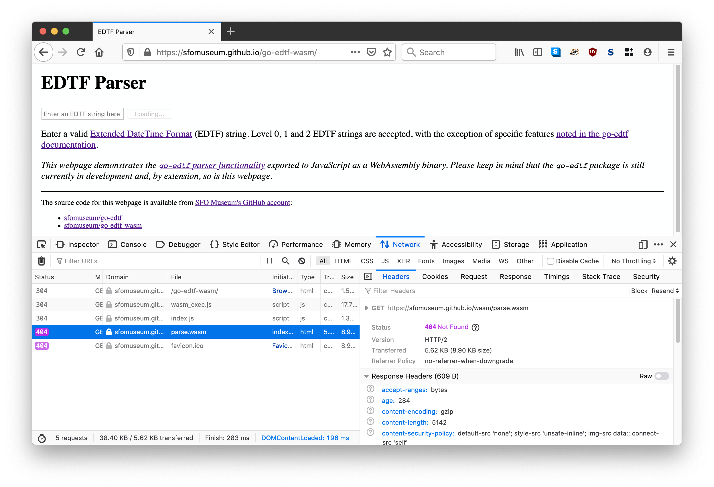

# go-edtf-wasm


Go package for exposing sfomuseum/go-edtf functionality as WebAssembly binaries.

## Building go-edtf-wasm

The easiest thing is to run the `wasm` Makefile target, like this:

```
$> make wasm
GOOS=js GOARCH=wasm go build -mod vendor -o www/wasm/parse.wasm cmd/parse/main.go
```

This will place a copy of the `parse.wasm` binary in `www/wasm/parse.wasm`.

The binary exposes a single `parse_edtf` function that takes a single string as its input and returns a JSON-encoded [edtf.EDTFDate](https://github.com/sfomuseum/go-edtf#date-spans-or-edtfedtfdate), or nil, as its response.

For example (with error handling omitted for the sake of brevity):

```
var raw_el = document.getElementById("raw");
var edtf_str = raw_el.value;

var result_el = document.getElementById("result");
result_el.innerHTML = "";
    
var rsp = parse_edtf(edtf_str);

if (! rsp){
    return;
}
	
var edtf_d = JSON.parse(rsp)
	
var pre = document.createElement("pre");
pre.innerText = JSON.stringify(edtf_d, '', 2);
	
result_el.appendChild(pre);
```

Obviously returning nil when there is a problem isn't great so the final return value remains to be determined.

## Serving go-edtf-wasm

The package comes with a handy `server` tool for serving the `parse.wasm` binary and a simple web page for parsing EDTF date strings.

```
$> make cli
go build -mod vendor -o bin/server cmd/server/main.go
```

The to run the server:

```
$> ./bin/server 
2021/01/07 17:56:48 Listening on http://localhost:8080
```

## GitHub Pages



There is a version of this application available at https://sfomuseum.github.io/go-edtf-wasm/ but it does not work as of this writing. Specifically GitHub Pages do not appear to support the hosting of `.wasm` files. In the screenshot above you can see that GitHub reports the `wasm/parse.wasm` as "Not found" even though [it is definitely there](https://github.com/sfomuseum/go-edtf-wasm/blob/gh-pages/wasm/parse.wasm).

If anyone knows how to fix this problem [please let me know](https://github.com/sfomuseum/go-edtf-wasm/issues).

## See also

* https://github.com/sfomuseum/go-edtf
* https://github.com/golang/go/wiki/WebAssembly
* https://github.com/aaronland/go-http-server
* https://github.com/aaronland/go-http-bootstrap